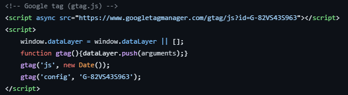
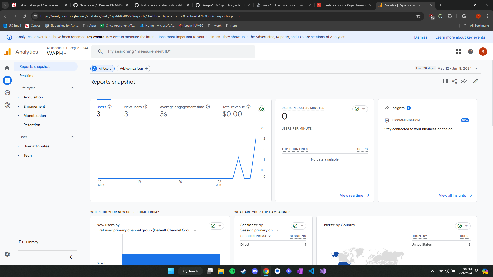
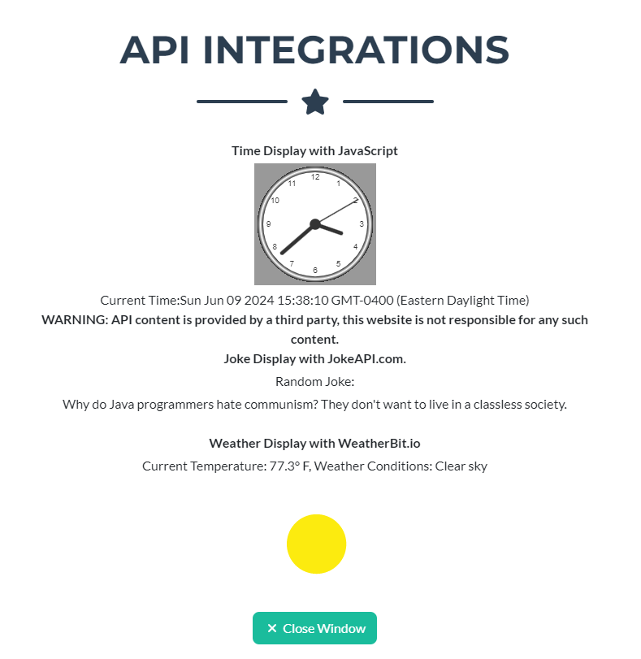
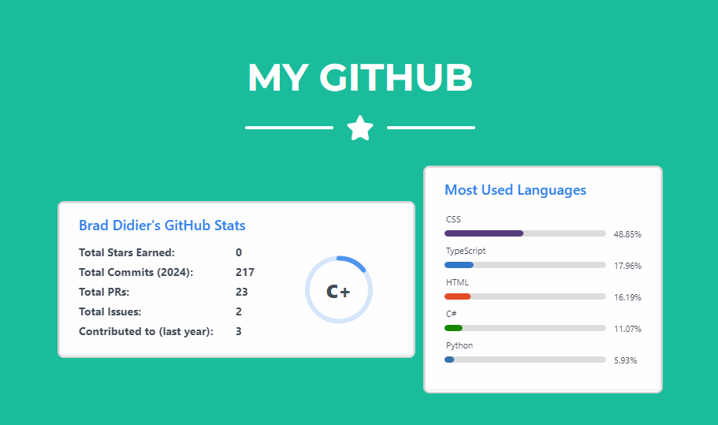
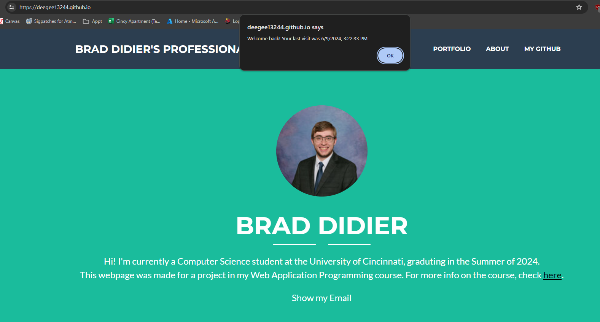

# WAPH-Web Application Programming and Hacking

## Instructor: Dr. Phu Phung

## Student

**Name**: Brad Didier

**Email**: didierbd@mail.uc.edu

**Short-bio**: Brad Didier is a computer science student at the University of Cincinnati.

# Project 1 - Front-End Web Development with a Professional Website

## Project Overview
In this project, I created a personal website for myself which featues a short description of me, my resume, some API integrations, and some neat JavaScript functionality. This website will be a good project to show potential employers and got me much more attuned to front-end web development.
My website can be found at the following link: [https://deegee13244.github.io/](https://deegee13244.github.io/), while the Github repository containing the code for the website can be found at this link: [https://github.com/Deegee13244/Deegee13244.github.io/tree/main](https://github.com/Deegee13244/Deegee13244.github.io/tree/main).

## General Requirements
There are two webpages available to visit at my website. The first was detailed above in the project overview. A screenshot of what the page looks like as you enter can be seen below. Additionally, there is a link available on the website that directs the user to the WAPH Course
Syllabus. The link to that can be found here: [https://deegee13244.github.io/waph.html](https://deegee13244.github.io/waph.html)

*Figure 1: My Professional Website*

## Non-technical Requirements
This website was built off of the Bootstrap template "Freelancer", found here: [https://startbootstrap.com/theme/freelancer](https://startbootstrap.com/theme/freelancer).
Additionally, this wesbite uses Google Analytics. The below code was put into the index.html file to allow Google to collect analytics about the webpage, which I can view from the portal, also shown below in Figure 3.

*Figure 2: Google Analytics Code*

*Figure 3: Google Analytics Dashboard*

## Technical Requirements
Much of the JavaScript code for showcasing the analog/digital clock and show/hiding my email was taken directly from Lab 2 for this course, as was the JavaScript logic to pull a random joke from the jokeAPI. For the additional API implementation, I show to use the weatherbit.io
API. The code to obtain the data from this API and display it can be found in the index.html file, on [Line 349](https://github.com/Deegee13244/Deegee13244.github.io/blob/ba5c4836161be1597bcddd006573c9bd466f7fa1/index.html#L349).

*Figure 4: API Integrations*

The additional functionality I decided to implement was to embed certain stats from my Github profile into my website. To do this, I used the [Github Readme Stats Project](https://github.com/anuraghazra/github-readme-stats), pulling the data from the url they provide, after inputting my Github username.

*Figure 5: Github Stats*

Finally, I was able to use JavaScript to set and grab cookies that told me when a user had last visited my website, successfully implementing the welcome message.

*Figure 6: Welcome Message*
